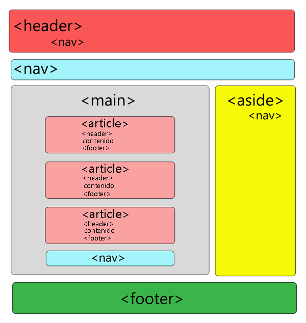

<h1 align="center">2 - Tags do HTML Semântico</h1>

Agora que já vimos sobre o que é o HTML Semântico vamos conhecer sobre as principais tags do HTML Semântico e alguns exemplos visuais.

## A tag &lt;header&gt;

O elemento HTML **&lt;header&gt;** representa
o cabeçalho, podemos utilizar no topo da nossa página para colocar links de navegação ou logos entre outras coisas, ou também podemos utilizar ele para representar como um cabeçalho de um artigo ou de algum bloco.

### **Exemplo:**

```html
<header>
  

  <nav>
    <ul>
      <li><a href="/">Inicio</a></li>
      <li><a href="/">Contato</a></li>
      <li><a href="/">Sobre Nós</a></li>
    </ul>
  </nav>
</header>
```


## A tag &lt;aside&gt;

A tag **&lt;aside&gt;** representa o no sidebar, ou seja aquele elemento que vai ficar nos cantos da nossa página, geralmente usada para agrupar menus laterais.

### **Exemplo:**

```html
<aside>
  <nav>
    <ul>
      <li><a href="/">Inicio</a></li>
      <li><a href="/">Contato</a></li>
      <li><a href="/">Sobre Nós</a></li>
    </ul>
  </nav>
</aside>
```


## A tag &lt;section&gt;

A tag **Section** representa uma seção dentro do nosso site, cada bloco um a baixo do outro que você quiser separar você pode utilizar a tag section, podemos ter a seção de contato, logo após podemos ter a seção de sobre nós, etc..., geralmente trabalhamos com um título dentro dessa section, dando ênfase ao conteúdo dela.

No exemplo abaixo podemos ver como temos cada seção representa uma seção de informações, primeiro temos o banner que é uma seção logo abaixo temos outra seção de informações e assim vai separamos por seção.

### **Exemplo:**

```html
<section>
  <h1>Esta seção é sobre contato</h1>
  <h4>Aqui temos um exemplo de descrição</h4>
</section>
<section>
  <h1>Esta seção é sobre a amostra do produto</h1>
  <h4>Aqui temos um outro exemplo de descrição</h4>
</section>
```


## A tag &lt;article&gt;

A tag **&lt;article&gt;** representa um conteúdo independente, exemplo artigo em um blog, ou um widget, algo que não precisa de outro pra fazer sentido, geralmente contém um titulo.

### **Exemplo:**

```html
<article>
  <h1>Isto é um exemplo de um artigo de um blog</h1>
  <p>Aqui temos um um texto sobre o artigo</p>
</article>
```


## A tag &lt;nav&gt;

A tag **&lt;nav&gt;** é utilizado quando queremos agrupar links de navegação que geralmente são criados com **ul**, **li** e **a**, geralmente utilizados dentro da tag **header** ou **aside**.

### **Exemplo:**

```html
<nav>
  <ul>
    <li><a href="/">Inicio</a></li>
    <li><a href="/">Contato</a></li>
    <li><a href="/">Sobre Nós</a></li>
  </ul>
</nav>
```


## A tag &lt;main&gt;

A tag **&lt;main&gt;** é representa o conteúdo principal do site e consequentemente o de maior relevância, geralmente é utilizado uma única vez.

### **Exemplo:**

```html
<main>
  <section>
    <h1>Isto é a seção de contato</h1>
  </section>
  <section>
    <h1>Isto é a seção de apresentação da empresa</h1>
  </section>
</main>
```



## A tag &lt;figure&gt;

A tag **&lt;figure&gt;** é utilizada para inserção de figuras na página, geralmente é utilizado em conjunto com a tag **&lt;figcaption&gt;** para caso quiser colocar uma descrição na imagem.

### **Exemplo:**

```html
<figure>
  

  <figcaption>Esta imagem é um exemplo de um artigo</figcaption>
</figure>
```


## A tag &lt;footer&gt;

A tag **&lt;footer&gt;** é utilizado quando queremos indicar um elemento que ficar na parte inferior de um site ou de um bloco.

Normalmente utilizada para inserir a autoria da página, assim como contatos e data de criação de conteúdos.

### **Exemplo:**

```html
<footer>
  <p>Copyright 2020 Empresa do Fulano</p>
</footer>
```


<h1>Refêrencias utilizados nesta página</h1>

- [HTML Semântico: Você sabe o que é? | Geek Blog](https://blog.geekhunter.com.br/voce-conhece-html-semantico/#O_que_e_HTML_semantico)
- [HTML Semântico: Conheça os elementos semânticos da HTML5
  | Devmedia](https://www.devmedia.com.br/html-semantico-conheca-os-elementos-semanticos-da-html5/38065#tag-article)
