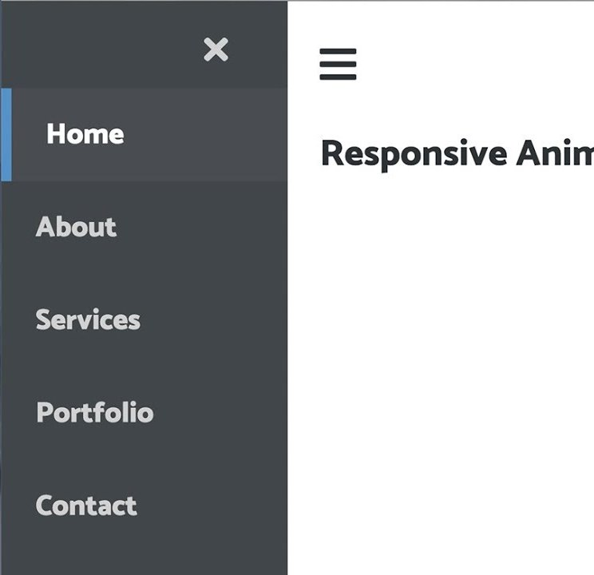

<h1 align="center">2 - Tags do HTML Semântico</h1>

Agora que já vimos sobre o que é o HTML Semântico vamos conhecer sobre as tags do HTML Semântico.

## A tag &lt;header&gt;

O elemento HTML **&lt;header&gt;** representa
o cabeçalho, podemos utilizar no topo da nossa página para colocar links de navegação ou logos entre outras coisas, ou também podemos utilizar ele para representar como um cabeçalho de um artigo ou de algum bloco.

### **Exemplo:**

## A tag &lt;aside&gt;

A tag **&lt;aside&gt;** representa o no sidebar, ou seja aquele elemento que vai ficar nos cantos da nossa página, geralmente usada para agrupar menus laterais.

### **Exemplo:**

## A tag &lt;section&gt;

A tag **Section** representa uma seção dentro do nosso site, cada bloco um a baixo do outro que você quiser separar você pode utilizar a tag section, podemos ter a seção de contato, logo após podemos ter a seção de sobre nós, etc..., geralmente trabalhamos com um título dentro dessa section, dando ênfase ao conteúdo dela.

No exemplo abaixo podemos ver como temos cada seção representa uma seção de informações, primeiro temos o banner que é uma seção logo abaixo temos outra seção de informações e assim vai separamos por seção.

### **Exemplo:**

<h1>Refêrencias utilizados nesta página</h1>

- [HTML Semântico: Você sabe o que é? | Geek Blog](https://blog.geekhunter.com.br/voce-conhece-html-semantico/#O_que_e_HTML_semantico)
